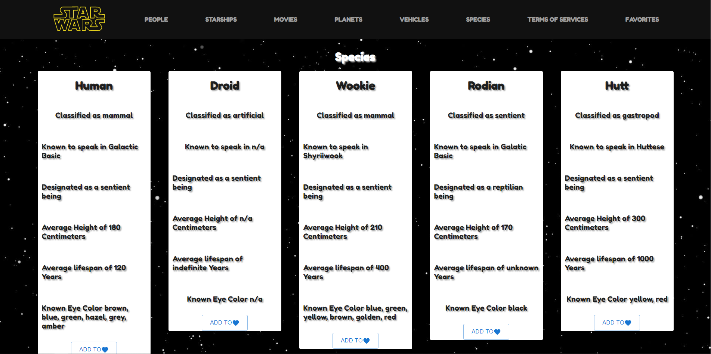

# The Smuggler's Den 
"The Smuggler's Den" is a website created for all Star Wars fans to explore the many aspects and intricacies of all things Star Wars!
Explore the canon and lore of planets, people, vehicles, species, and starships within the Star Wars universe! 

# How To Run
The Smuggler's Den is deployed online, so please click this [link](https://glistening-bubblegum-23a522.netlify.app/)

# Created By
Rahmin Shoukoohi

[LinkedIn](https://www.linkedin.com/in/rahmin-shoukoohi-155855235/)

[email](rahminshoukoohi@gmail.com)

Here is more information about the website written in this [Medium Article]()

# Website Overview
"The Smuggler's Den" uses both React and Redux. Visitors of the website can explore all the canon and lore intricacies of the Star Wars Universe. Each page identifies and displays different aspects of the Star Wars universe, including the different planets, vehicles used, featured characters, different species, and the many starships used throughout the canon and lore of Star Wars. Users can also add each item from the different pages into their favorites page to view them later. 

# Features

* minimalist and simple design 
* Users can explore different pages of their favorite Star Wars lore and canon
* Users can add each item into their favorites page and have them displayed in a card fashion, as well as being able to remove the item later if they so choose to
* Fully mobile responsive
# Color Palette
- #1b1b1b
- #9d9d9d
- #1976d2
- #f2dc1d!

# Thoughts on The Smuggler's Den
This website is the fourth major project in our Digital Crafts Coding Bootcamp. It is created to identify and demonstrate an understanding of React.js for the frontend framework, and Redux to manage global state data. 

To further develop "The Smuggler's Den', I would: 
- create a backend and allow users to create an account on the webpage
- user login, user specific favorites page, and the ability to make posts within a forums page for users to share their favorite Star Wars items in a public stage

# Photos

